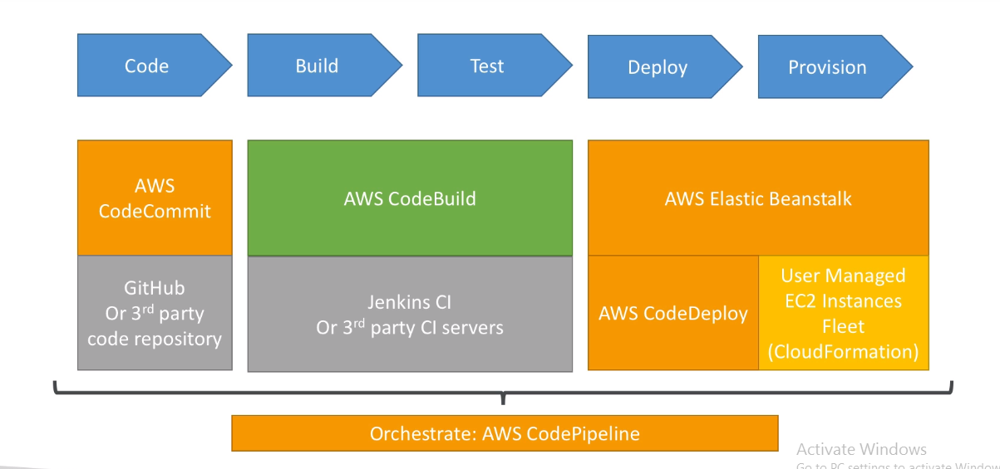

In this cloudformation stack deployment there are two steps to follow.

1. Setup an AWS four(4) stage CI/CD pipeline with manual approval in each steps.
2.  Writing a template for an architecture using few AWS services.
  
First step we have to build a CI/CD pipeline using cloudformation template. For this I have used AWS services such as AWS pipeline, codecommit, codebuild, codedeply. From below diagram we can understand how these each services are integrated each other.

For this we have to follow few steps to build our pipeline using cloudformation template. I have uploaded the template file (pipeline-template.yml)  to git for pipeline creation. 
1.	First login in to your AWS account and go to cloudformation service.
2.	There you can see create stack button and once you click it you will be redirected to template file upload window.
3.	Select the option “Template is Ready” and upload the pipeline-template.yml file to there.
4.	When you click next in the next page it is asking a name for the stack.
5.	

